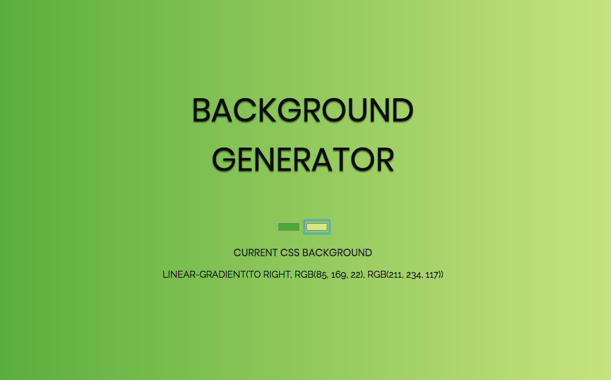

# Hexadecimal background generator

The codebase is written in HTML5, CSS3, and the behaviour for the website in Javascript.

## Preview

The whole process was made possible with the DOM

## AUTHOR

Oteri Eyenike
